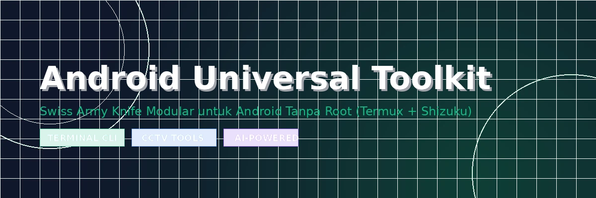

<div align="center">

<!-- BANNER -->


<!-- TYPING ANIMATION -->


<!-- BADGES -->
<p>
  
  
  
  
  
  
  
  
</p>

<p>
  <a href="https://github.com/myruldev/Android-Universal-Toolkit/stargazers">
    
  </a>
  <a href="https://github.com/myruldev/Android-Universal-Toolkit/network/members">
    
  </a>
  <a href="https://github.com/myruldev/Android-Universal-Toolkit/watchers">
    
  </a>
</p>

</div>

---

> **Android Universal Toolkit (AUT)** adalah *Swiss Army Knife* modular berbasis **Command-Line Interface (CLI)** yang berjalan langsung di **Termux** dengan kekuatan **Shizuku (rish)**. Dirancang untuk pengguna yang ingin mengoptimalkan Android secara ekstrem **TANPA ROOT**, sekaligus menjadi senjata andalan **Teknisi CCTV & Jaringan** saat bekerja *on-site* di lapangan.

---

## 📋 Daftar Isi

- [✨ Fitur Unggulan](#-fitur-unggulan)
- [📦 Persyaratan Sistem](#-persyaratan-sistem)
- [⚙️ Cara Instalasi](#️-cara-instalasi)
- [🚀 Cara Menjalankan](#-cara-menjalankan)
- [📂 Struktur Proyek](#-struktur-proyek)
- [🗂️ Penjelasan Modul Lengkap](#️-penjelasan-modul-lengkap)
- [🤖 Konfigurasi AI (OpenRouter)](#-konfigurasi-ai-openrouter)
- [🎥 Demo & Screenshot](#-demo--screenshot)
- [❓ FAQ & Troubleshooting](#-faq--troubleshooting)
- [🤝 Berkontribusi](#-berkontribusi)
- [👤 Tentang Developer](#-tentang-developer)
- [📄 Lisensi](#-lisensi)

---

## ✨ Fitur Unggulan

<table>
  <tr>
    <td>🚀 <b>Performance</b><br/>Dexopt AOT, Doze Ekstrem, RAM Cleaner, Refresh Rate Locker</td>
    <td>🛡️ <b>Security & Debloat</b><br/>Permission Audit, Revoke Paksa, App Freezer, Bloatware Remover</td>
    <td>📡 <b>Network Tools</b><br/>Port Scanner, DNS Tuner, WiFi Detail, Bandwidth Monitor</td>
  </tr>
  <tr>
    <td>🎥 <b>Field Tech (CCTV)</b><br/>ONVIF Scanner, RTSP Tester, IP Cam Detector, RJ-45 Pinout</td>
    <td>🔍 <b>Diagnostics</b><br/>Device Info, Thermal Monitor, Logcat AI, Partisi Map</td>
    <td>🧪 <b>Experimental</b><br/>Resolution Changer, DPI Scaler, Hidden Settings Opener</td>
  </tr>
  <tr>
    <td>🤖 <b>AI Assistant</b><br/>OpenRouter Integration (Gemini/Llama), Technical Bot, Logcat Analyzer</td>
    <td>🚨 <b>Emergency</b><br/>Safe Mode Boot, SystemUI Restart, Force Stop All Apps</td>
    <td>💾 <b>Backup & Config</b><br/>Backup Otomatis, Restore Setting, Export Log ke Storage</td>
  </tr>
</table>

---

## 📦 Persyaratan Sistem

Sebelum instalasi, pastikan perangkat Anda memenuhi semua persyaratan berikut:

| Komponen | Syarat | Keterangan |
|---|---|---|
| 📱 Versi Android | **Android 11+** | Diperlukan untuk fitur Wireless Debugging |
| 📦 Termux | **Versi terbaru (F-Droid)** | **JANGAN** pakai versi Play Store (sudah usang) |
| ⚡ Shizuku | **Versi 13+** | Wajib aktif sebelum menjalankan AUT |
| 🐍 Python | **Python 3.x** | Untuk modul AI & ONVIF Scanner |
| 📡 Nmap | **Opsional** | Untuk fitur Network Port Scanner |
| 🔑 OpenRouter API | **Opsional** | Untuk fitur AI Technical Assistant |

> ⚠️ **Penting:** Gunakan Termux dari **F-Droid** atau **GitHub Releases**, bukan dari Google Play Store. Versi Play Store tidak lagi mendapatkan update dan bisa menyebabkan error.

---

## ⚙️ Cara Instalasi

### **Langkah 1 — Aktifkan Developer Options & Wireless Debugging**

Sebelum menggunakan Shizuku, Anda perlu mengaktifkan opsi pengembang di HP Android Anda:

1. Buka **Pengaturan (Settings)**
2. Pilih **Tentang Ponsel (About Phone)**
3. Ketuk **Nomor Build (Build Number)** sebanyak **7 kali** hingga muncul notifikasi "You are now a developer!"
4. Kembali ke **Pengaturan** → Cari **Opsi Pengembang (Developer Options)**
5. Aktifkan toggle **Wireless Debugging** (Debugging Nirkabel)

```
Pengaturan → Tentang Ponsel → Nomor Build (ketuk 7x)
Pengaturan → Opsi Pengembang → Wireless Debugging → ON ✅
```

---

### **Langkah 2 — Install & Aktifkan Shizuku**

Shizuku adalah "jembatan" yang memberikan AUT akses ke perintah ADB-level tanpa PC dan tanpa Root.

1. **Download Shizuku** dari salah satu sumber berikut:
   - [GitHub Releases (Resmi)](https://github.com/RikkaApps/Shizuku/releases)
   - [Google Play Store](https://play.google.com/store/apps/details?id=moe.shizuku.privileged.api)

2. **Aktifkan Shizuku** lewat Wireless Debugging:
   - Buka aplikasi **Shizuku**
   - Tap **"Mulai via Wireless Debugging"**
   - Tap **"Pair Device with Pairing Code"** di menu Wireless Debugging HP Anda
   - Masukkan kode pairing yang muncul di notifikasi Shizuku

3. **Verifikasi Shizuku berjalan:**
   - Di halaman utama Shizuku, pastikan statusnya **"Shizuku sedang berjalan"** ✅

> 💡 **Tips:** Agar Shizuku tidak dimatikan oleh sistem, buka **Shizuku → Settings → Battery Optimization** dan set ke **Unrestricted**.

---

### **Langkah 3 — Install Termux & Package yang Dibutuhkan**

```bash
# Update repository Termux
pkg update && pkg upgrade -y

# Install package yang dibutuhkan AUT
pkg install -y python nmap nano zip unzip curl

# Setup akses storage (izinkan akses ke /sdcard)
termux-setup-storage
```

Ketuk **Allow** saat diminta izin akses penyimpanan.

---

### **Langkah 4 — Download & Ekstrak AUT**

**Metode A — Via Git (Direkomendasikan):**
```bash
# Clone repo
git clone https://github.com/myruldev/Android-Universal-Toolkit.git

# Masuk ke folder proyek
cd Android-Universal-Toolkit
```

**Metode B — Via ZIP Download:**
```bash
# Download file ZIP
curl -L -o AUT.zip https://github.com/myruldev/Android-Universal-Toolkit/archive/refs/heads/main.zip

# Ekstrak
unzip AUT.zip
cd Android-Universal-Toolkit-main
```

---

### **Langkah 5 — Beri Izin Eksekusi**

```bash
# Beri izin eksekusi ke semua script
chmod +x aut.sh
chmod +x modules/*.sh

# Verifikasi izin
ls -la modules/
```

Output yang diharapkan:
```
-rwxr-xr-x 1 u0_a123 ... performance.sh
-rwxr-xr-x 1 u0_a123 ... security.sh
-rwxr-xr-x 1 u0_a123 ... network.sh
-rwxr-xr-x 1 u0_a123 ... field_tech.sh
-rwxr-xr-x 1 u0_a123 ... diagnostics.sh
-rwxr-xr-x 1 u0_a123 ... experimental.sh
-rwxr-xr-x 1 u0_a123 ... emergency.sh
```

---

### **Langkah 6 — Izinkan Termux di Shizuku**

Ini adalah langkah paling penting agar AUT bisa menjalankan perintah Shizuku!

1. Buka aplikasi **Shizuku**
2. Scroll ke bawah → Cari **"Termux"** di daftar aplikasi
3. Tap tombol toggle di sebelah Termux untuk memberikan izin
4. Konfirmasi izin dengan tap **"Allow"** / **"Izinkan"**

---

### **Langkah 7 — Setup `rish` di Termux (Penghubung Shizuku ↔ Termux)**

`rish` adalah perintah yang dipakai AUT untuk mengirim perintah ke Shizuku. **Tanpa `rish`, semua menu yang butuh akses sistem tidak akan berfungsi.** Lakukan langkah ini cukup sekali.

**1. Ekspor file rish dari aplikasi Shizuku**

- Buka aplikasi **Shizuku** → pastikan status **"Shizuku sedang berjalan"**.
- Scroll ke bawah ke bagian **"Gunakan Shizuku di aplikasi terminal"** (Use Shizuku in terminal apps).
- Ketuk bagian itu, baca peringatannya, lalu pilih **Ekspor / Export**.
- Shizuku akan menyimpan **dua file**: `rish` dan `rish_shizuku.dex` (biasanya ke folder **Download** atau **/sdcard/Shizuku**).

**2. Salin file ke Termux**

```bash
# Pastikan akses storage sudah aktif
termux-setup-storage

# Sesuaikan lokasi file hasil ekspor (contoh di bawah: folder Download)
cp ~/storage/shared/Download/rish $PREFIX/bin/rish
cp ~/storage/shared/Download/rish_shizuku.dex $HOME/rish_shizuku.dex

# Beri izin eksekusi pada rish
chmod +x $PREFIX/bin/rish
```

> Jika file diekspor ke `/sdcard/Shizuku`, ganti path-nya menjadi `~/storage/shared/Shizuku/`.

**3. Atur Application ID (penting!)**

`rish` perlu tahu paket terminal yang dipakai. Untuk Termux:

```bash
echo 'export RISH_APPLICATION_ID="com.termux"' >> ~/.bashrc
source ~/.bashrc
```

> Pada versi `rish` lama yang belum mendukung variabel ini, buka file dengan `nano $PREFIX/bin/rish` lalu ganti tulisan `PKG` menjadi `com.termux`.

**4. Uji koneksi rish**

```bash
rish -c "id"
```

Jika berhasil, akan muncul output mirip seperti ini:

```
uid=2000(shell) gid=2000(shell) groups=2000(shell) ...
```

Itu artinya AUT sudah siap menjalankan perintah Shizuku. 

**Catatan penting:**

- Shizuku harus **berjalan setiap kali HP dinyalakan ulang**. Setelah reboot, buka Shizuku dan aktifkan kembali (via Wireless Debugging) **sebelum** menjalankan AUT.
- Error `rish_shizuku.dex not found` → pastikan file `.dex` berada di folder home Termux (`$HOME`) dan jangan dipindah.
- Error permission saat menjalankan `rish` → jalankan `chmod 600 $HOME/rish_shizuku.dex`.
- Error `command not found: rish` → ulangi langkah 2 dan pastikan `rish` ada di `$PREFIX/bin`.

---

## 🚀 Cara Menjalankan

Setelah semua langkah instalasi selesai, jalankan AUT dengan:

```bash
./aut.sh
```

Anda akan disambut dengan menu utama AUT:

```
             █████  ██   ██ ████████
            ██   ██ ██   ██    ██
            ███████ ██   ██    ██
            ██   ██ ██   ██    ██
            ██   ██  █████     ██

  ┌────────────────────────────────────────────────┐
  │        Android Universal Toolkit (AUT)           │
  │                     v1.0.0                       │
  ├────────────────────────────────────────────────┤
  │  Website  : www.myrul.dev                        │
  │  Facebook : facebook.com/myruldev                │
  └────────────────────────────────────────────────┘

  Menu Utama
  ----------

   1  Performance Optimizer
   2  Security, App Manager & Debloat
   3  Network & WiFi Tools
   4  Field Tech Tools (CCTV / IP Camera)
   5  Diagnostics, System Info & Logcat
   6  Experimental & System Scaling
   7  Emergency & Recovery Mode
   8  Ask AI Assistant (OpenRouter)
   9  Settings / Konfigurasi

   0  Keluar

  Pilih opsi:
```

---

## 📂 Struktur Proyek

```
Android-Universal-Toolkit/
│
├── 📄 aut.sh                    ← Script utama (entry point)
│
├── 📁 modules/                  ← Modul-modul fungsional
│   ├── 🚀 performance.sh        ← Optimizer & Battery Saver
│   ├── 🛡️  security.sh           ← Security & Debloat Manager
│   ├── 📡 network.sh            ← Network & WiFi Tools
│   ├── 🎥 field_tech.sh         ← CCTV & IP Camera Tools
│   ├── 🔍 diagnostics.sh        ← Diagnostics & Log Analyzer
│   ├── 🧪 experimental.sh       ← Resolution, DPI & Hidden Settings
│   └── 🚨 emergency.sh          ← Emergency Recovery Tools
│
├── 📁 helpers/                  ← Script pembantu (Python)
│   ├── 🤖 ai_helper.py          ← OpenRouter AI Integration
│   └── 📡 onvif_scan.py         ← ONVIF IP Camera Scanner (SSDP)
│
├── 📁 config/
│   └── ⚙️  config.conf           ← File konfigurasi utama (API Key, dll)
│
├── 📁 assets/                   ← Gambar & asset README
│   └── 🖼️  banner.webp           ← Banner header proyek
│
└── 📄 README.md                 ← Dokumentasi lengkap ini
```

---

## 🗂️ Penjelasan Modul Lengkap

### 🚀 Modul 1: Performance Optimizer

Meningkatkan performa HP Android Anda hingga level maksimal tanpa root.

| Fitur | Perintah Shizuku | Keterangan |
|---|---|---|
| **Compile Dexopt Speed** | `cmd package compile -m speed -a` | Kompilasi AOT semua app, loading jadi super instan |
| **Extreme Doze Mode** | `dumpsys deviceidle force-idle` | Paksa HP ke Deep Idle, hemat baterai ekstrem |
| **Lock Refresh Rate** | `settings put system peak_refresh_rate 120` | Kunci 90/120Hz agar animasi selalu mulus |
| **RAM Cache Cleaner** | `am kill-all` | Bersihkan background app dan bebaskan RAM |

---

### 🛡️ Modul 2: Security & Debloat

Audit keamanan dan bersihkan aplikasi bawaan yang memakan resource.

| Fitur | Perintah Shizuku | Keterangan |
|---|---|---|
| **Permission Audit** | `dumpsys package` + filter | Scan app dengan izin Kamera/Mic/Lokasi aktif |
| **Revoke Permission** | `pm revoke <pkg> <permission>` | Cabut izin sensitif aplikasi secara paksa |
| **App Freezer** | `pm disable-user <package>` | Bekukan app tanpa uninstall agar tidak berjalan |
| **Re-enable App** | `pm enable <package>` | Aktifkan kembali app yang dibekukan |

---

### 📡 Modul 3: Network & WiFi Tools

Alat jaringan profesional yang biasanya hanya ada di laptop teknisi.

| Fitur | Metode | Keterangan |
|---|---|---|
| **Live Port Scanner** | `nmap -sV <ip>` | Scan port terbuka di IP target di LAN |
| **DNS Benchmark** | `ping` + analisis | Cek DNS terkencang dari daftar (Cloudflare, Google, dll) |
| **Set Private DNS** | `settings put global private_dns_mode` | Ganti DNS ke mode hostname langsung dari CLI |
| **WiFi Info Detail** | `dumpsys wifi` | Tampilkan IP, Gateway, Subnet, SSID, BSSID aktif |
| **Reset Network Stack** | `cmd connectivity reset` | Reset WiFi/BT/Data jika jaringan glitch |

---

### 🎥 Modul 4: Field Tech — CCTV & IP Camera

> Modul ini dirancang khusus untuk **Teknisi CCTV & IT** yang sering bekerja di lapangan.

| Fitur | Metode | Keterangan |
|---|---|---|
| **ONVIF Camera Scanner** | Python SSDP Multicast | Deteksi otomatis semua IP Camera di jaringan yang support ONVIF |
| **RTSP Stream Tester** | `am start` (VLC/MPV) | Tes live stream RTSP kamera via VLC yang terpasang di HP |
| **IP Range Scanner** | `nmap -sn <range>` | Pindai semua perangkat aktif di segmen LAN (192.168.1.0/24) |
| **Port CCTV Checker** | `nmap -p 80,554,8000,37777` | Cek port khas DVR/NVR (HTTP, RTSP, Dahua, Hikvision) |
| **RJ-45 Pinout Guide** | Tabel visual CLI | Referensi urutan warna kabel LAN T568B (Straight) & T568A (Cross) |

**Contoh Output Pinout Guide di Terminal:**
```
╔═══ PANDUAN KABEL LAN RJ-45 ════════════════════════╗
║  Standar T568B (Straight Through / Lurus)           ║
╠════════╦═════════════════════════════════════════════╣
║  Pin 1 ║ 🟠 Putih-Oranye                            ║
║  Pin 2 ║ 🟠 Oranye                                  ║
║  Pin 3 ║ 🟢 Putih-Hijau                             ║
║  Pin 4 ║ 🔵 Biru                                    ║
║  Pin 5 ║ 🔵 Putih-Biru                              ║
║  Pin 6 ║ 🟢 Hijau                                   ║
║  Pin 7 ║ 🟤 Putih-Coklat                            ║
║  Pin 8 ║ 🟤 Coklat                                  ║
╚════════╩═════════════════════════════════════════════╝
```

---

### 🔍 Modul 5: Diagnostics & System Logs

Informasi mendalam tentang kondisi hardware dan software perangkat Anda.

| Fitur | Sumber Data | Keterangan |
|---|---|---|
| **Device Info Lengkap** | `getprop` | Model, Android ver, patch keamanan, chip, RAM |
| **Thermal Monitor** | `/sys/class/thermal/` | Suhu CPU per-core secara real-time |
| **Storage & Partisi Map** | `df -h` | Kapasitas & sisa ruang `/data`, `/system`, `/sdcard` |
| **Live Logcat Stream** | `logcat -v brief *:E` | Stream log error sistem secara real-time |
| **AI Logcat Analyzer** | OpenRouter API | Ambil 50 baris log error terakhir → minta AI jelaskan & berikan solusi |

---

### 🧪 Modul 6: Experimental & System Scaling

Fitur eksperimental yang powerful namun harus digunakan dengan bijak.

| Fitur | Perintah Shizuku | Keterangan |
|---|---|---|
| **Resolution Changer** | `wm size <WxH>` | Ubah resolusi (misal ke 720x1560 untuk boost FPS game) |
| **DPI Scaler** | `wm density <dpi>` | Ubah kerapatan layar agar UI muat lebih banyak elemen |
| **Reset ke Default** | `wm size reset && wm density reset` | Kembalikan resolusi & DPI ke bawaan pabrik |
| **Hidden Settings** | `am start -n <activity>` | Buka menu tersembunyi: Notification Log, Bandwidth Usage, dll |

> ⚠️ **Perhatian:** Mengubah resolusi atau DPI yang terlalu ekstrem bisa membuat layar tampak blank. Jika terjadi, jalankan perintah reset dari adb di PC.

---

### 🚨 Modul 7: Emergency & Recovery Mode

Digunakan saat HP bermasalah atau tidak bisa masuk ke menu sistem secara normal.

| Fitur | Perintah | Keterangan |
|---|---|---|
| **Restart SystemUI** | `am crash com.android.systemui` | Restart layar/launcher yang freeze tanpa reboot HP |
| **Force Stop All Apps** | `am kill-all` | Hentikan semua app di background secara paksa |
| **Reset Resolusi & DPI** | `wm size reset && wm density reset` | Kembalikan tampilan layar jika distorsi |
| **Clear Cache Semua App** | Loop `pm clear` | Bersihkan cache seluruh aplikasi user sekaligus |

---

### 🤖 Modul 8: Ask AI Assistant (OpenRouter)

Asisten AI yang memahami dunia teknisi lapangan, jaringan, dan CCTV.

- **Model Default:** `google/gemini-2.0-flash-exp:free` (via OpenRouter)
- **Topik yang Bisa Ditanyakan:**
  - Konfigurasi router Mikrotik, TP-Link, Cisco
  - Troubleshooting CCTV offline atau stream putus
  - Analisis log error Android
  - Perintah ADB/Shizuku yang spesifik
  - Skema wiring dan kalkulasi kebutuhan PoE switch
  - Penjelasan error yang ditemukan di `logcat`

---

## 🤖 Konfigurasi AI (OpenRouter)

Untuk mengaktifkan fitur **AI Technical Assistant**, Anda perlu memasukkan API Key OpenRouter.

### Cara Mendapatkan API Key (Gratis):
1. Buka [openrouter.ai](https://openrouter.ai)
2. Daftar / Login akun Anda
3. Pergi ke menu **Keys** → **Create Key**
4. Salin API Key yang dihasilkan (format: `sk-or-v1-xxxxx`)

### Cara Memasukkan API Key ke AUT:

**Metode 1 — Lewat Menu AUT:**
```
Pilih menu [9] ⚙️ Pengaturan & Konfigurasi
→ [1] Set OpenRouter API Key
→ Masukkan API Key Anda
```

**Metode 2 — Edit File Langsung:**
```bash
nano config/config.conf
```
Ubah baris:
```bash
OPENROUTER_API_KEY=""
```
Menjadi:
```bash
OPENROUTER_API_KEY="sk-or-v1-xxxxxxxxxxxxxxxx"
```
Simpan dengan `Ctrl+O` → `Enter` → `Ctrl+X`

### Model AI yang Tersedia (Gratis di OpenRouter):
| Model | ID | Kekuatan |
|---|---|---|
| Google Gemini 2.0 Flash | `google/gemini-2.0-flash-exp:free` | Cepat & pintar (Default) |
| Meta Llama 3.1 8B | `meta-llama/llama-3.1-8b-instruct:free` | Ringan & efisien |
| Mistral 7B | `mistralai/mistral-7b-instruct:free` | Bagus untuk kode |
| DeepSeek R1 | `deepseek/deepseek-r1:free` | Analisis mendalam |

---

## 🎥 Demo & Screenshot

> 📸 Screenshot demo akan tersedia setelah rilis publik pertama.
> Bantu kami dengan mencoba tools ini dan kirimkan screenshot hasil penggunaan Anda!

### Preview Menu Field Tech (CCTV Scanner):
```
┌────────────────────────────────────────────────┐
│        Android Universal Toolkit (AUT)           │
├────────────────────────────────────────────────┤
│  Website  : www.myrul.dev                        │
│  Facebook : facebook.com/myruldev                │
└────────────────────────────────────────────────┘

  Field Tech Tools (CCTV / IP Camera)
  -----------------------------------

   1  Scan ONVIF Camera di Jaringan Lokal
   2  Tebak Path RTSP CCTV (Hikvision, Dahua, dll)
   3  Play Live Stream RTSP (VLC / MPV)
   4  Scan IP & Port Terbuka (Nmap)
   5  RJ45 Pinout Guide (T568A / T568B)

   0  Kembali ke Menu Utama

  Pilih opsi: 1

  [*] Memulai pemindaian ONVIF IP Camera di subnet lokal...
  [+] Ditemukan perangkat ONVIF: 192.168.1.105
  [+] Ditemukan perangkat ONVIF: 192.168.1.106
  Total kamera ONVIF terdeteksi: 2
```

---

## ❓ FAQ & Troubleshooting

<details>
<summary><b>❌ Error: "rish: command not found" saat jalankan aut.sh</b></summary>

**Penyebab:** Shizuku belum diaktifkan atau file `rish` belum ada di PATH Termux.

**Solusi:**
1. Pastikan Shizuku sudah aktif (cek statusnya di app Shizuku)
2. Buka Shizuku → tap **"Managers"** → aktifkan toggle untuk **Termux**
3. Di Termux, jalankan: `pkg install rish` atau download manual dari repo Shizuku
4. Test dengan perintah: `rish -c 'echo test'` — jika muncul `test`, Shizuku sudah terkoneksi ✅
</details>

<details>
<summary><b>❌ Error: "Permission denied" saat menjalankan module</b></summary>

**Penyebab:** Script belum diberi izin eksekusi.

**Solusi:**
```bash
chmod +x aut.sh
chmod +x modules/*.sh
chmod +x helpers/*.py
```
</details>

<details>
<summary><b>❌ Shizuku mati sendiri setelah beberapa saat</b></summary>

**Penyebab:** Android mengoptimasi baterai Shizuku dan mematikannya di background.

**Solusi:**
1. Buka **Pengaturan → Aplikasi → Shizuku**
2. Pilih **Baterai** → Set ke **Tidak Dibatasi (Unrestricted)**
3. Alternatif: Gunakan aplikasi **Automate** atau **Tasker** untuk auto-restart Shizuku saat boot
</details>

<details>
<summary><b>❌ Fitur ONVIF Scanner tidak menemukan kamera padahal ada</b></summary>

**Penyebab:** Beberapa kamera IP tidak support protokol ONVIF atau multicast diblokir router.

**Solusi:**
1. Pastikan HP dan kamera berada di **subnet yang sama** (misal: semua di 192.168.1.x)
2. Coba gunakan fitur **"Scan IP Range LAN"** sebagai alternatif
3. Cek manual IP kamera dari stiker di body kamera atau dari DVR/NVR
</details>

<details>
<summary><b>❌ Layar HP jadi blank/hitam setelah ubah resolusi</b></summary>

**Penyebab:** Nilai resolusi yang dimasukkan terlalu ekstrem untuk HP Anda.

**Solusi (dari Termux - jika masih bisa):**
```bash
rish -c 'wm size reset && wm density reset'
```

**Solusi (dari PC via ADB - jika layar total hitam):**
```bash
adb shell wm size reset
adb shell wm density reset
```
</details>

<details>
<summary><b>❓ Apakah AUT aman digunakan? Apakah bisa merusak HP?</b></summary>

AUT menggunakan level akses yang sama dengan ADB — **tidak lebih tinggi dari itu**. Selama Anda tidak menggunakan modul **Experimental** secara sembarangan, risiko kerusakan sangat minimal.

Semua operasi di modul Performance, Security, Network, Field Tech, dan Diagnostics adalah **reversible** (bisa dikembalikan). Kami selalu menyertakan opsi **"Reset ke Default"** di setiap fitur yang mengubah pengaturan sistem.
</details>

---

## 🤝 Berkontribusi

Kontribusi dalam bentuk apapun sangat disambut! Berikut cara Anda bisa membantu:

### Cara Berkontribusi:
1. **Fork** repositori ini
2. Buat branch baru: `git checkout -b fitur/nama-fitur-baru`
3. Commit perubahan: `git commit -m "feat: tambah fitur X"`
4. Push ke branch: `git push origin fitur/nama-fitur-baru`
5. Buat **Pull Request** ke branch `main`

### Yang Bisa Dikontribusikan:
- 🐛 **Bug Fix** — Laporkan atau perbaiki bug yang Anda temukan
- ✨ **Fitur Baru** — Tambahkan modul atau sub-fitur baru
- 📝 **Dokumentasi** — Perbaiki atau tambahkan penjelasan
- 🌐 **Database** — Tambahkan RTSP path untuk merek/model kamera baru
- 🎨 **UI Enhancement** — Perbaiki tampilan menu CLI

### Pedoman Kontribusi:
- Ikuti gaya penulisan Bash yang sudah ada (indentasi 2 spasi)
- Setiap fungsi baru harus dilengkapi komentar penjelasan
- Test script di minimal 1 perangkat sebelum membuat PR
- Jangan commit API Key atau data sensitif

---

## 👤 Tentang Developer

<div align="center">
  
  <br/>
  <b>Amirul Mukminin</b>
  <br/>
  <i>CCTV & IT Field Technician | Vibe Coder | AI-Assisted Automation Enthusiast</i>
  <br/><br/>
  <a href="https://myrul.dev"></a>
  <a href="mailto:myruldev@gmail.com"></a>
  <a href="https://wa.me/6289997779944"></a>
  <a href="https://github.com/myruldev"></a>
  <br/><br/>
  <i>"Coding is my supporting skill, Field Insight is my main power." 🚀</i>
</div>

### Proyek Lain dari Developer Ini:
| Proyek | Deskripsi |
|---|---|
| 📱 [MiDebloat-Remover (MDR)](https://github.com/myruldev/MiDebloat-Remover) | Tool debloat Xiaomi/MIUI/HyperOS tanpa root via Termux + Shizuku |
| 🤖 [Android-Universal-Debloat (AUD)](https://github.com/myruldev/Android-Universal-Debloat) | Debloat universal 25+ merek Android dengan database terlengkap |

---

## ⚠️ DWYOR (Do With Your Own Risk) & Disclaimer

Seluruh alat, skrip, dan modul yang disediakan dalam **Android Universal Toolkit (AUT)** ini ditujukan **HANYA untuk tujuan pembelajaran, edukasi, dan membantu pekerjaan teknis secara sah**. 

Dengan mengunduh, memasang, atau menggunakan toolkit ini, Anda menyetujui ketentuan berikut:
1. **Tanggung Jawab Pribadi:** Segala konsekuensi, kerusakan, bootloop (sangat jarang terjadi tapi mungkin), kehilangan data, atau kegagalan sistem pada perangkat Android Anda adalah tanggung jawab Anda sepenuhnya.
2. **Tidak Ada Garansi:** Toolkit ini disediakan "apa adanya" (*AS IS*) tanpa jaminan dalam bentuk apa pun. Developer tidak menjamin semua modul akan berfungsi 100% sempurna di semua tipe HP, custom ROM, atau versi Android.
3. **Gunakan dengan Bijak:** Jangan gunakan alat ini untuk tindakan ilegal, memindai jaringan orang lain tanpa izin tertulis, atau aktivitas merugikan lainnya.

*Bila Anda ragu, selalu lakukan backup data penting Anda sebelum menjalankan optimasi ekstrem atau debloating!*

---

## 📄 Lisensi

```
MIT License

Copyright (c) 2026 myruldev (Amirul Mukminin)

Permission is hereby granted, free of charge, to any person obtaining a copy
of this software and associated documentation files (the "Software"), to deal
in the Software without restriction, including without limitation the rights
to use, copy, modify, merge, publish, distribute, sublicense, and/or sell
copies of the Software, and to permit persons to whom the Software is
furnished to do so, subject to the following conditions:

The above copyright notice and this permission notice shall be included in all
copies or substantial portions of the Software.

THE SOFTWARE IS PROVIDED "AS IS", WITHOUT WARRANTY OF ANY KIND, EXPRESS OR
IMPLIED, INCLUDING BUT NOT LIMITED TO THE WARRANTIES OF MERCHANTABILITY,
FITNESS FOR A PARTICULAR PURPOSE AND NONINFRINGEMENT. IN NO EVENT SHALL THE
AUTHORS OR COPYRIGHT HOLDERS BE LIABLE FOR ANY CLAIM, DAMAGES OR OTHER
LIABILITY, WHETHER IN AN ACTION OF CONTRACT, TORT OR OTHERWISE, ARISING FROM,
OUT OF OR IN CONNECTION WITH THE SOFTWARE OR THE USE OR OTHER DEALINGS IN THE
SOFTWARE.
```

---

<div align="center">

**Dibuat dengan ❤️ oleh [myruldev](https://github.com/myruldev) | Guncangkan Tools Termux 2026 🚀**


</div>
